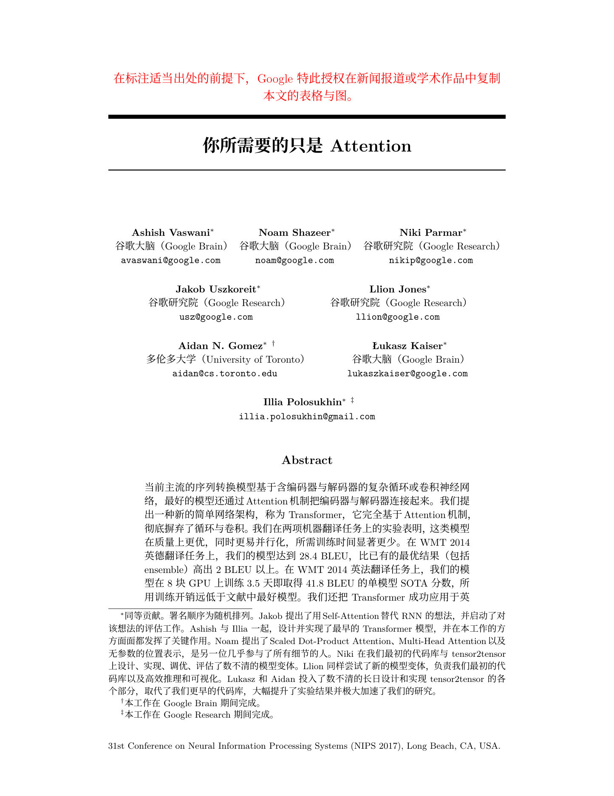
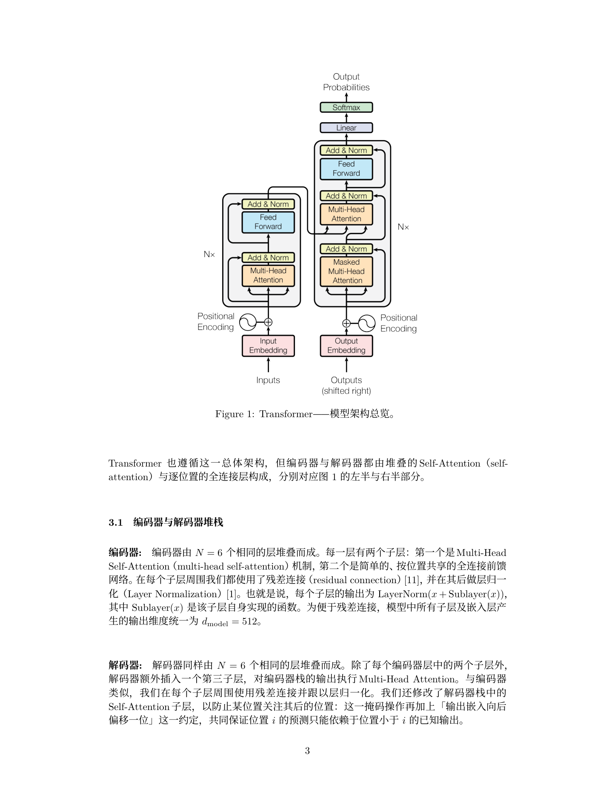
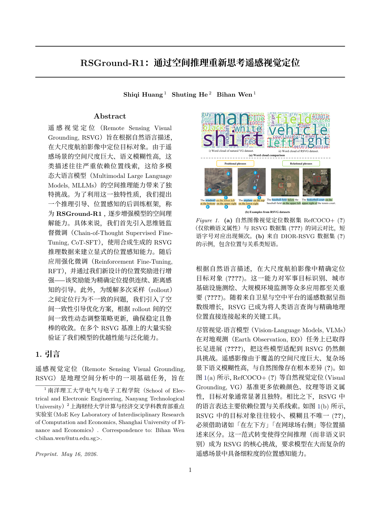
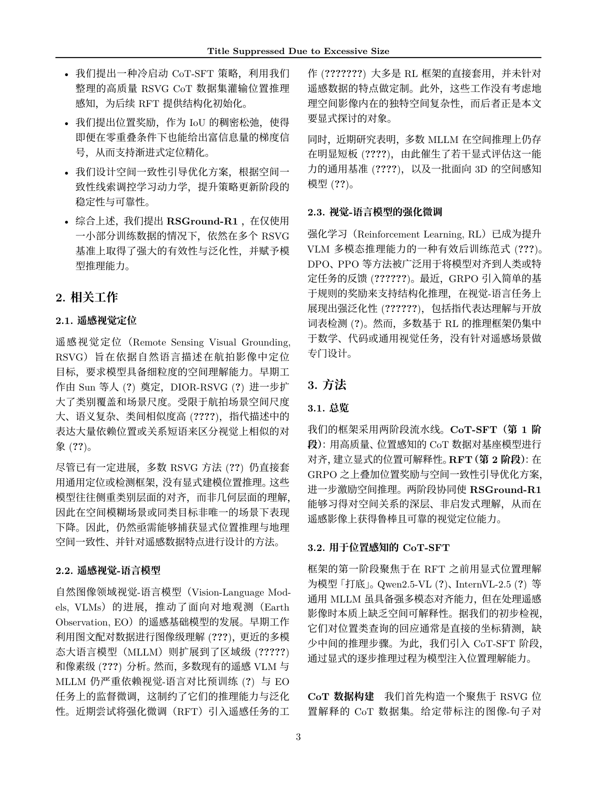
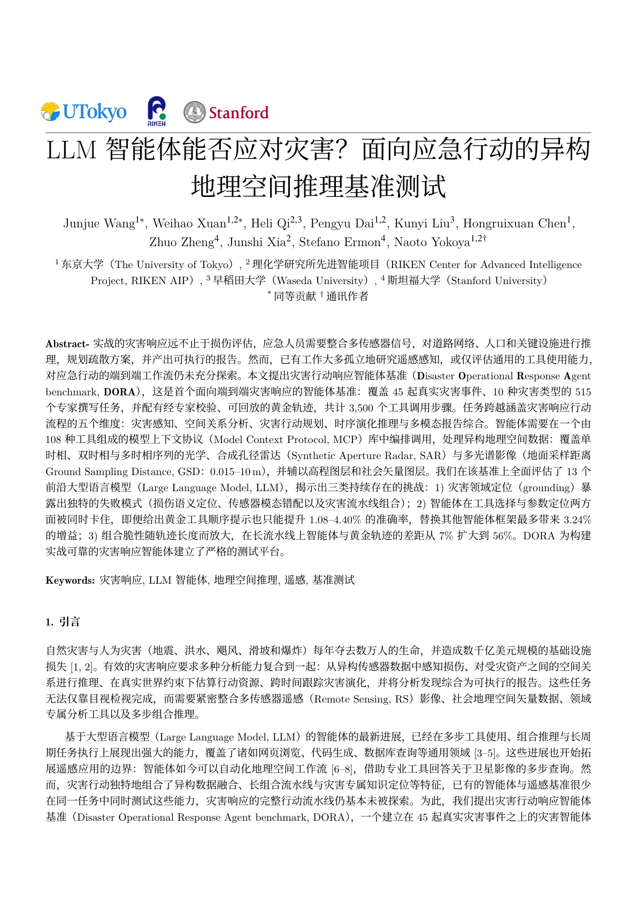
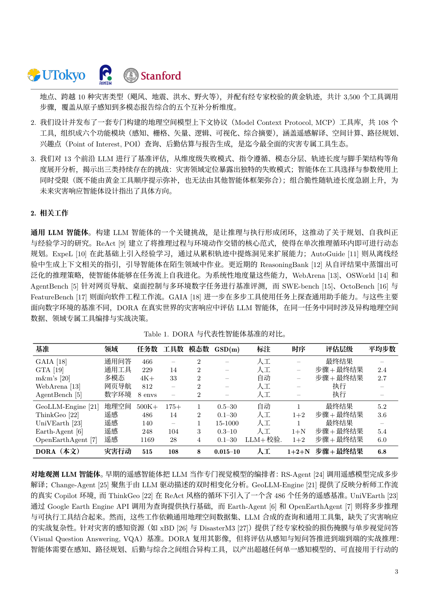
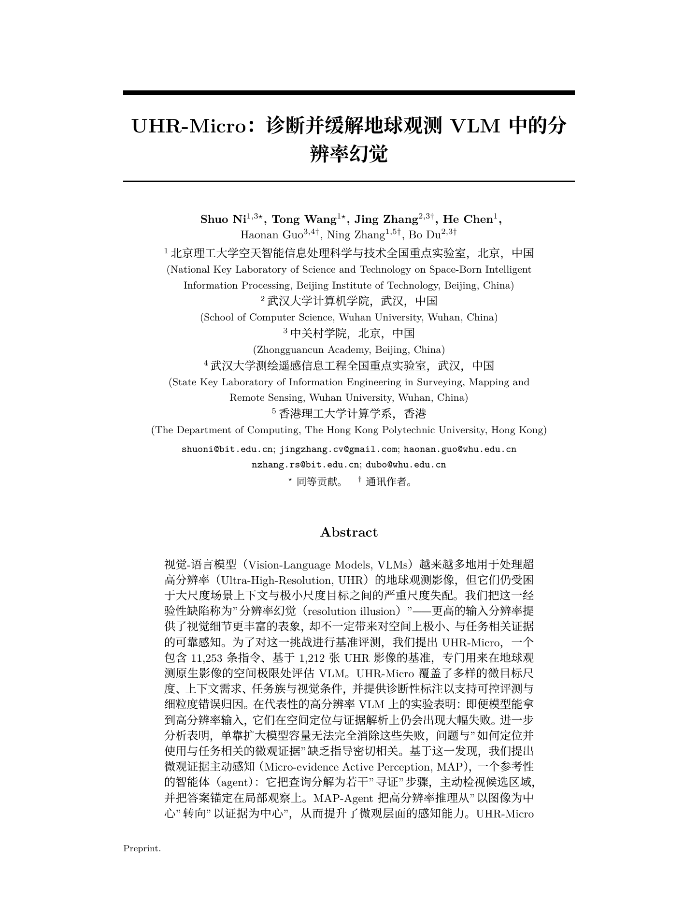
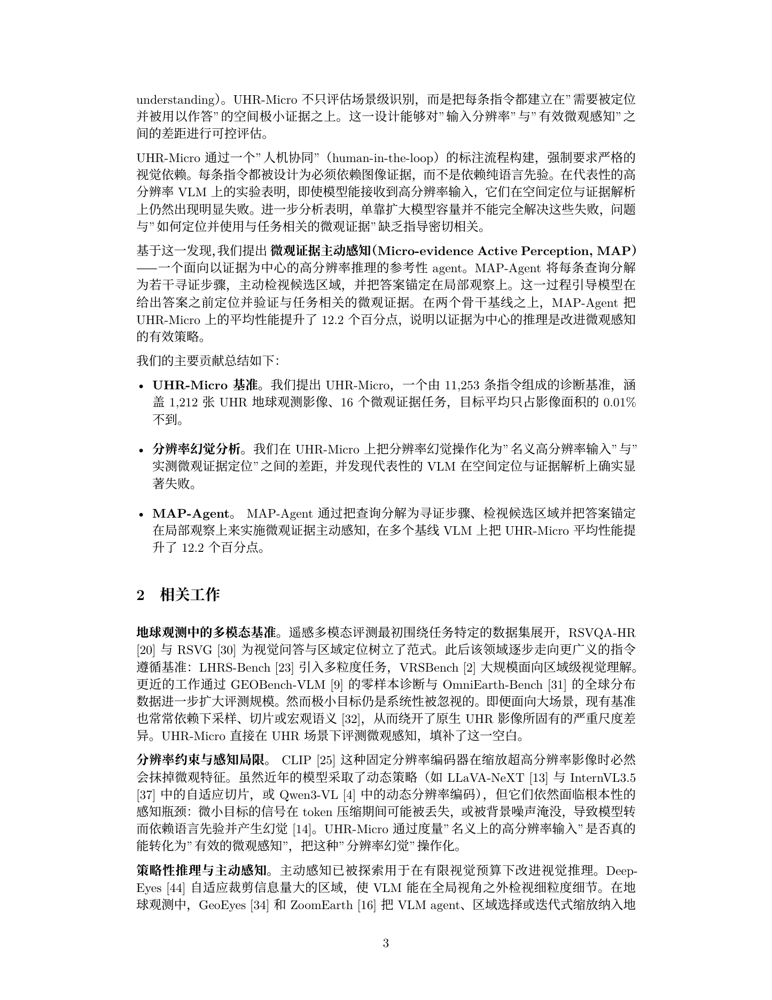

# ChineseXiv

> arXiv 论文一键变中文 PDF —— 一个 Claude Code / Codex 通用 Skill。

把 arXiv 上一篇英文论文的 LaTeX 源码下载下来，按学术风格翻译成中文，再用 `xelatex` 编译成排版正常的 PDF，整个过程**模型自己完成**，你只需要把论文 ID 或标题丢给 Agent。

本仓库 fork & 增强自 **[Leey21/arxiv-translator](https://github.com/Leey21/arxiv-translator)**，在它的工程基础上做了若干面向"想多翻一点、想要本地离线编译"的改造。详见下方[与上游差异](#与上游差异)。

---

## 安装

> Skill 是给 AI Agent 读的、把领域工作流封装成结构化说明的 Markdown 文件（Anthropic 官方叫 **Claude Skills**，跨平台语境下也叫 **Agent Skills**，参见 [agentskills.io](https://agentskills.io)）。安装就是把 `chinesexiv/` 这个目录放进 Agent 的 skills 目录，立刻可用。

### 方式 A：通过对话装入 Agent 的 skills 目录（推荐）

1. Clone 本仓库：

   ```bash
   git clone https://github.com/yuchenwu73/chinesexiv.git
   ```

2. 打开 Claude Code / Codex / Cursor 对话，把仓库里的 `chinesexiv/` 目录路径告诉 Agent：

   ```text
   路径 <绝对路径>/chinesexiv 中定义了一个 Skill，请你阅读并安装到你的 skills 目录下。
   ```

   Claude Code 会装到 `~/.claude/skills/chinesexiv/`，Codex 会装到 `~/.codex/skills/chinesexiv/`。

### 方式 B：手动放置

直接把 `chinesexiv/` 目录复制到对应位置：

```bash
cp -r chinesexiv ~/.claude/skills/        # Claude Code
cp -r chinesexiv ~/.codex/skills/         # Codex
```

### 依赖

- Python 3.9+
- `requests`（在线编译需要）：`pip install requests`
- 可选 `pypdf`（自动校验 PDF 是否有未解析引用）：`pip install pypdf`
- 本地编译模式额外需要：TeX Live（含 `xelatex` + `xeCJK` + Noto Serif CJK SC 字体）

未装 `xelatex` 也能用——`--engine auto` 会自动走在线编译服务。

---

## 它能做什么

装好 Skill 之后直接说话即可：

- 「帮我把 1706.03762 翻译成中文 PDF」
- 「`Attention Is All You Need` 我想读中文版」
- 「翻译这篇 arXiv：https://arxiv.org/abs/2501.12948」
- 「翻译 2501.12948 和 1706.03762」（多篇）

Agent 会按本 Skill 里的四步流程跑：

1. **确定 arXiv ID** —— 给 URL/ID 直接用；给标题就上 arXiv 找。
2. **拉源码** —— `scripts/download.py` 下载、解压、定位主 `.tex`、抓论文标题，并把主文件及其 `\input`/`\include` 引用全部复制一份 `_zh.tex` 副本（英文原文只读保留，翻译只动 `_zh`）。
3. **翻译** —— 模型直接对 `_zh.tex` 系列文件就地修改。术语遵循"首次出现给中英对照"规则，机构名/描述性方法名也翻译，专有模型名（GPT-4、LLaMA…）和数据集名（ImageNet、MMLU…）保留英文。翻译完用 `scripts/inspect_tex.py` 扫一遍漏译。
4. **编译** —— `scripts/compile.py` 默认 `--engine auto`：本地有 `xelatex` 就走本地，否则回落到在线编译。中文 PDF 直接放到输出目录、文件名就是中文 `\title{}`。

最终交付：

- `$OUTPUT/<中文标题>.pdf`
- `$OUTPUT/source/` —— 英文原文 + `_zh.tex` 译稿，方便对照、手动重编

---

## 效果展示

下面是用本 skill 翻译过的**四篇真实论文**的页面快照——版式、公式、表格、参考文献编号都跟英文原文一致，只把语言换成了中文；机构名、描述性方法名按"中文全称（English Full Name, ABBR）"首现规则给出对照；人名、专有模型/数据集名保留英文。

<table>
<tr>
<td width="50%"></td>
<td width="50%"></td>
</tr>
<tr>
<td colspan="2" align="center"><sub>《你所需要的只是 Attention》（Vaswani et al., arXiv:1706.03762）—— 标题页 + Transformer 架构</sub></td>
</tr>
<tr>
<td width="50%"></td>
<td width="50%"></td>
</tr>
<tr>
<td colspan="2" align="center"><sub>《RSGround-R1：通过空间推理重新思考遥感视觉定位》（arXiv:2601.21634）—— 标题页 + 正文</sub></td>
</tr>
<tr>
<td width="50%"></td>
<td width="50%"></td>
</tr>
<tr>
<td colspan="2" align="center"><sub>《LLM 智能体能否应对灾害？面向应急行动的异构地理空间推理基准测试》（arXiv:2605.11633）—— 标题页 + 含三线表的正文</sub></td>
</tr>
<tr>
<td width="50%"></td>
<td width="50%"></td>
</tr>
<tr>
<td colspan="2" align="center"><sub>《UHR-Micro：诊断并缓解地球观测 VLM 中的分辨率幻觉》（arXiv:2605.12237）—— 标题页 + 方法描述</sub></td>
</tr>
</table>

---

## 编译引擎

```bash
python3 chinesexiv/scripts/compile.py <work_dir> <main_tex> <output.pdf> --engine {auto,local,online}
```

| 引擎 | 用途 | 依赖 |
|---|---|---|
| `auto`（默认） | 装了 `xelatex` 用本地，否则在线 | 看本地情况 |
| `local` | 强制本地 `xelatex`，最快、可离线、可控完整 | TeX Live + `xeCJK` |
| `online` | 强制走 [`latex.ytotech.com`](https://latex.ytotech.com)，免本地 LaTeX | 仅 `requests` |

两种引擎共用同一套源码预处理：自动注入 `xeCJK` + Noto Serif CJK SC、注释掉冲突的 `inputenc`/`fontenc`、识别 `bibtex`/`biber`/预编译 `.bbl`、跳过未引用的游离 PDF。

---

## 与上游差异

相对 [Leey21/arxiv-translator](https://github.com/Leey21/arxiv-translator)，本仓库的主要改造：

| 维度 | Leey21 上游 | ChineseXiv |
|---|---|---|
| **编译引擎** | 仅在线（LuaLaTeX，latex-on-http） | **本地 xelatex + 在线双引擎**，`--engine auto/local/online` |
| **英文原文** | 直接覆写 `.tex` | 主文件及 `\input` 子文件都复制为 `_zh.tex` **副本**，英文原文只读保留，便于对照与重译 |
| **翻译范围** | 默认只翻正文 | 默认全文翻译（含附录），用户可显式要求"只翻正文" |
| **术语规则** | 通用约束 | **新增"首次出现规则"**：长词组首现写"中文全称（English Full Name, ABBR）"，全文统一缩写；摘要与正文各自独立计数 |
| **机构名/描述性方法名** | 保留不翻 | **改为必翻**，给出中英对照 |
| **CJK 栈** | LuaLaTeX + luatexja | XeLaTeX + xeCJK + Noto Serif CJK SC，注入额外的行距 1.25 与中英文间距 |
| **质检** | `inspect_tex.py` body 模式 | 默认 `full` 模式扫全文，扫描 `_zh.tex` |
| **输出命名** | 主文件名 | 翻译后的 `\title{}` 自然命名 |
| **清理** | 删 `.tmp_arxiv` | 保留 `_zh.tex` 源码 + 删本地 `build/` 中间产物，方便手动重编 |

---

## 仓库结构

```
chinesexiv/
├── chinesexiv/                  # Skill 本体（一份完整的 Claude/Agent Skill）
│   ├── SKILL.md                 # Skill 主说明（Agent 真正读取的入口）
│   ├── scripts/
│   │   ├── download.py          # 下载 arXiv e-print + 定位主文件 + 建 _zh 副本
│   │   ├── inspect_tex.py       # 启发式扫描漏译
│   │   ├── compile.py           # 本地 xelatex / 在线编译双引擎
│   │   └── cleanup.py           # 删 build/ 与中间产物，保留 _zh.tex 源码
│   └── references/
│       ├── table-overflow.md     # 表格与中文重叠的诊断 + \resizebox 修复范式
│       ├── framed-content.md    # 附录 tcolorbox / lstlisting 的排版基线与溢出修复
│       ├── compile-errors.md    # 编译错误速查
│       └── author-block.md      # 作者/机构区排版与译名规范
├── assets/                      # README 展示图
├── LICENSE                      # MIT
└── README.md
```

`SKILL.md` 开头的 YAML frontmatter（`---` 包起来的那段）里 `name` 和 `description` 是必需字段——Agent 凭这两项判断何时该触发本 Skill。

---

## 限制

- 仅适用于 arXiv 上提供 LaTeX 源码的论文，**纯 PDF 投稿不在范围内**。
- 翻译质量取决于 Agent 当前会话所用模型；不同模型 / 不同提示词下结果会有差异。
- 在线编译走公共服务 [`latex.ytotech.com`](https://latex.ytotech.com)；想完全离线请用 `--engine local`。

---

## 致谢 🙏

- **[Leey21/arxiv-translator](https://github.com/Leey21/arxiv-translator)** —— 工程骨架、`_zh` 之外的整体流程、`inspect_tex.py` 启发式扫描思路均来自此项目，ChineseXiv 在它的基础上做改造。强烈推荐去看上游 README 里的设计动机。
- **[LaTeX-On-HTTP](https://github.com/YtoTech/latex-on-http)** —— 在线编译能力的提供方。`compile.py --engine online` 通过其公共服务 `https://latex.ytotech.com/builds/sync` 提交工程，省去本地维护完整 LaTeX 环境的成本。

如果本项目对你有用，欢迎也去给上游一个 star。

---

## License

MIT。详见 [`LICENSE`](LICENSE)。
